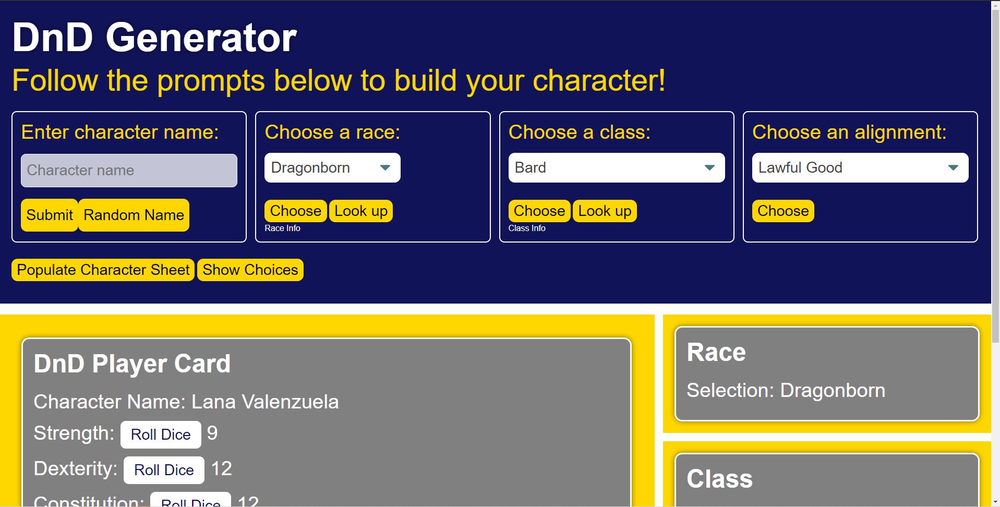
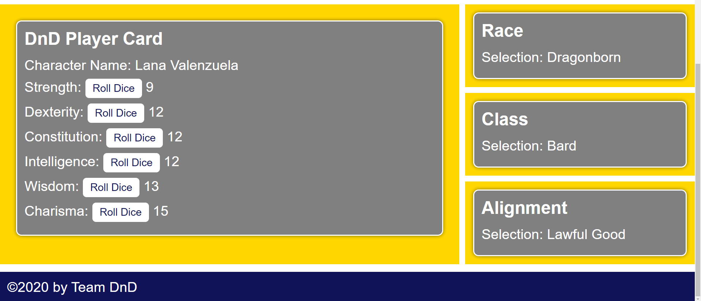

# Project 1: Interactive Front-End Project
Karyn English
Blake Pangman
John McKechnie
Sean Suwanaloet

* DnD generator app to help any Dungeons and Dragons (DnD) newcomer hit the ground running in a fresh DnD campaign. 

# Features- 
* Ability to choose name, race, class, and alignment for character
* Character Sheet for recording choices or rolls of name, race, class, alignment, and character attributes
* Random number generator created in javascript to independently roll character attributes of Strength, Dexterity, Constitution, Intelligence, Wisdom, and Charisma
* Random name generator api for character name creation if the imagination is lacking (from https://randommer.io/Name)
* Integrated with dnd information resource api for comprehensive information on selected race and class for the curious mind (https://www.dnd5eapi.co/)
* Localstorage functionality for all chracter sheet and random number data
* Populate from localstorage functionality
* Button to hide response fields if so desired, to declutter application visual space once choices have been made. Button also populates character sheet from localstorage
* Button to reshow response fields if previously hidden, useful to make core core changes to the character data.

* Github: https://github.com/johnmckech/group-project/
* Github Deploy: https://johnmckech.github.io/group-project/
* 
* 